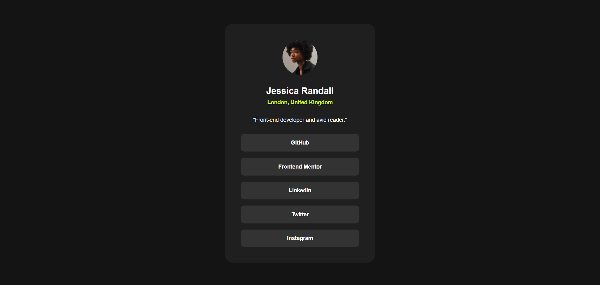
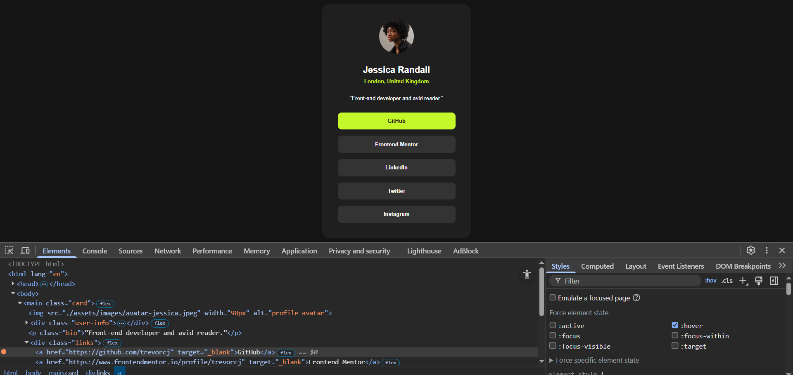

# Frontend Mentor - Social links profile solution

This is a solution to the [Social links profile challenge on Frontend Mentor](https://www.frontendmentor.io/challenges/social-links-profile-UG32l9m6dQ). Frontend Mentor challenges help you improve your coding skills by building realistic projects.

## Table of contents

- [Overview](#overview)
  - [The challenge](#the-challenge)
  - [Screenshot](#screenshot)
  - [Links](#links)
- [My process](#my-process)
  - [Built with](#built-with)
- [Author](#author)
- [Acknowledgments](#acknowledgments)

## Overview

### The challenge

Users should be able to:

- See hover and focus states for all interactive elements on the page

### Screenshot

### Links

- Solution URL: [View solution](https://github.com/trevorcj/frontend-mentor-social-links-profile)
- Live Site URL: [View Live](https://trevorcj-social-links-profile.netlify.app)

## My process

### Built with

- Semantic HTML5 markup
- CSS custom properties
- Flexbox

## Author

- LinkedIn - [Connect here](https://www.linkedin.com/in/trevorcjustus/)
- Frontend Mentor - [@trevorcj](https://www.frontendmentor.io/profile/trevorcj)
- Twitter - [@trevoppa](https://www.x.com/trevoppa)

## Acknowledgments

The Frontend Mentor team ♥
